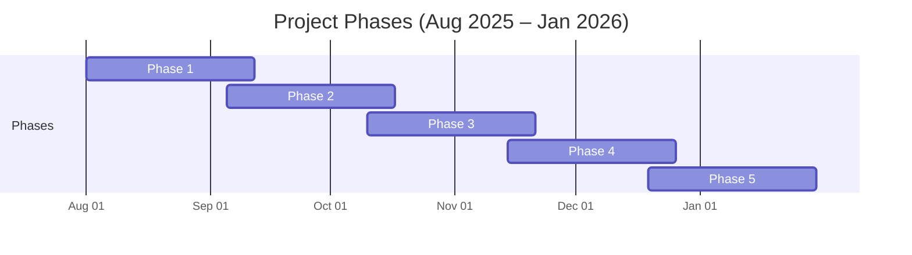

# Project Gantt Diagram

## Overview

- **Period**: August 1, 2025 – January 31, 2026 (~26 weeks)
- **Phases**: 5 phases, each lasting 6 weeks (42 days)
- **Overlap**: Each consecutive phase overlaps by 1 week (7 days)

| Phase   | Start Date  | End Date    |
|---------|-------------|-------------|
| Phase 1 | 2025-08-01  | 2025-09-11  |
| Phase 2 | 2025-09-05  | 2025-10-16  |
| Phase 3 | 2025-10-10  | 2025-11-20  |
| Phase 4 | 2025-11-14  | 2025-12-25  |
| Phase 5 | 2025-12-19  | 2026-01-29  |
